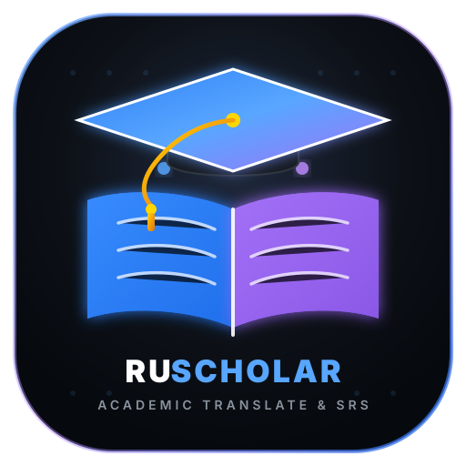
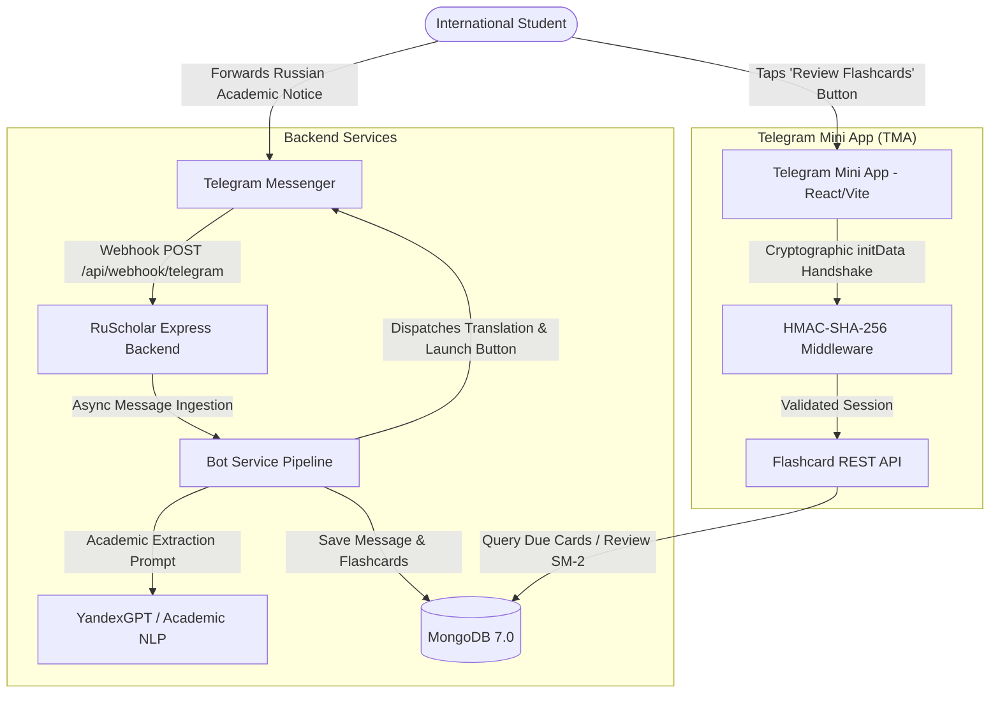
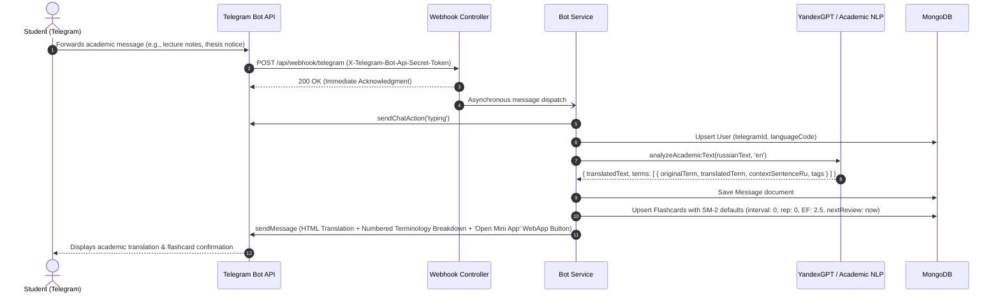
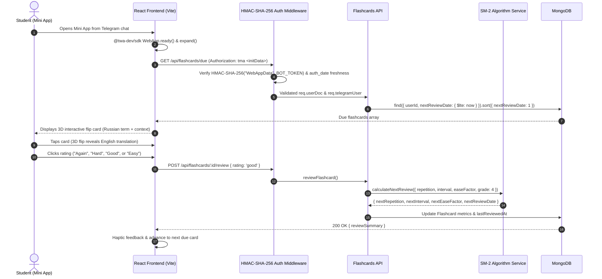
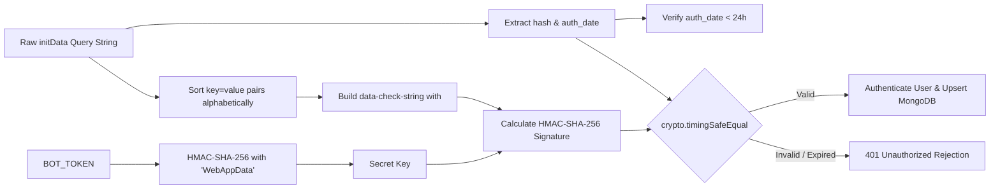

<div align="center">
  
  <h1>RuScholar TMA</h1>
  <p><b>Academic Translate &amp; Learn for International Students in Russia</b></p>
  <p><i>Enterprise-grade Telegram Bot &amp; Integrated Mini App (TMA)</i></p>

  <p>
    <a href="#-the-real-world-academic-problem-solved">Problem Solved</a> •
    <a href="#-system-architecture">Architecture</a> •
    <a href="#-end-to-end-sequence-workflows">Workflows</a> •
    <a href="#-cryptographic-security--telegram-verification">Security</a> •
    <a href="#-quick-start--installation">Quick Start</a> •
    <a href="#-contact--author-information">Contact</a>
  </p>

  [](https://www.typescriptlang.org/)
  [](https://nodejs.org/)
  [](https://expressjs.com/)
  [](https://react.dev/)
  [](https://www.mongodb.com/)
  [](https://core.telegram.org/bots/webapps)
  [](https://www.docker.com/)
  [](LICENSE)
</div>

> **Master's in Software Engineering Portfolio Project** (**Open Doors Russian Scholarship Project**).  
> Designed to empower international university students across the Russian Federation to overcome academic language barriers with AI translation and Spaced Repetition (SM-2).

---

## 🎯 The Real-World Academic Problem Solved

Every year, tens of thousands of international students arrive in the Russian Federation to pursue advanced degrees in Software Engineering, Computer Science, Mathematics, Physics, and Medicine. Despite completing preparatory language faculties (подфак), international students encounter severe linguistic and cognitive friction upon entering actual university degree programs:

```
┌────────────────────────────────────────────────────────────────────────────────────────┐
│                        THE INTERNATIONAL STUDENT CHALLENGE IN RUSSIA                   │
├────────────────────────────────┬───────────────────────────────┬───────────────────────┤
│ 1. Heavy Academic Telegram Use │ 2. Technical Context Collapse  │ 3. The Retention Gap  │
│ Russian universities           │ Standard translation tools    │ Copy-pasting into     │
│ (деканат, кафедры, староста)   │ fail on university-specific   │ translators provides  │
│ broadcast homework, thesis     │ terminology (e.g. "зачёт",    │ momentary clarity,    │
│ deadlines, and lab notes       │ "курсовая работа",            │ but students quickly  │
│ exclusively in Telegram.       │ "дифференциальное уравнение").│ forget key terms.     │
└────────────────────────────────┴───────────────────────────────┴───────────────────────┘
```

### How RuScholar Solves This

1. **Zero Context Switching**: Students stay inside Telegram. When an intimidating Russian announcement arrives, they simply **forward the message** to `@RuScholarBot`.
2. **Academic Terminology Extraction**: The bot translates the text and uses an Academic NLP / YandexGPT service to extract technical terms with bidirectional Russian/English contextual sentences.
3. **Automated SRS Flashcard Generation**: The extracted terms are instantly saved to MongoDB with default **SuperMemo SM-2 Spaced Repetition System** metrics.
4. **Telegram Mini App (TMA)**: The student taps one button to launch the embedded React Mini App, reviewing flashcards with scientific intervals ("Again", "Hard", "Good", "Easy") right inside Telegram.

---

## 🏛 System Architecture

The project is structured as a clean monorepo separating the Express/TypeScript API backend from the Vite/React Mini App frontend while sharing domain models and security contracts:



---

## 🔄 End-to-End Sequence Workflows

### 1. Academic Forwarding & Term Extraction Workflow



### 2. Mini App Review & SM-2 Spaced Repetition Workflow



---

## 🔐 Cryptographic Security & Telegram Verification

The system complies with Telegram's official cryptographic authentication specification:



---

## 📂 Repository Structure

```
RuScholar-TMA/
├── backend/                           # Node.js + Express + TypeScript API
│   ├── src/
│   │   ├── config/                    # Validated environment & MongoDB lifecycle
│   │   ├── controllers/               # Webhook & Flashcard REST controllers
│   │   ├── middlewares/               # HMAC-SHA-256 validator & error handlers
│   │   ├── models/                    # Mongoose schemas (User, Message, Flashcard)
│   │   ├── routes/                    # Express modular route definitions
│   │   ├── services/                  # Telegram Bot, LLM NLP, and SM-2 services
│   │   └── types/                     # Strict TypeScript interfaces
│   ├── tests/                         # Unit tests (HMAC, SM-2, and LLM)
│   ├── Dockerfile                     # Multi-stage production container
│   └── README.md                      # Backend technical documentation
├── frontend/                          # React 19 + TypeScript + Vite Mini App
│   ├── src/
│   │   ├── api/                       # Axios client with initData interceptors
│   │   ├── components/                # 3D Flip Card, Tabs, Navbar, Dictionary
│   │   ├── context/                   # TelegramContext wrapping @twa-dev/sdk
│   │   └── hooks/                     # useTelegram hook
│   ├── nginx.conf                     # Production Nginx with Gzip & CSP headers
│   ├── Dockerfile                     # Multi-stage Nginx Alpine container
│   └── README.md                      # Frontend technical documentation
├── docker-compose.yml                 # Orchestration for Mongo, Backend, Frontend
├── LICENSE                            # MIT License
└── README.md                          # Root system architecture documentation
```

---

## 🚀 Quick Start & Installation

### Option 1: Docker Compose (Recommended)

To spin up MongoDB, the Backend API, and the Frontend Nginx web server in isolated containers:

```bash
# 1. Clone repository
git clone https://github.com/SaadRimeh/RuScholar-TMA.git
cd RuScholar-TMA

# 2. Copy environment templates
cp backend/.env.example backend/.env

# 3. Launch the container stack
docker compose up -d --build
```
* **Frontend TMA**: `http://localhost:8080`
* **Backend API**: `http://localhost:5000/api`
* **MongoDB**: `localhost:27017`

### Option 2: Local Development Setup

#### Backend Setup:
```bash
cd backend
npm install
cp .env.example .env
npm test            # Runs cryptographic & SM-2 test suites
npm run dev         # Launches server on http://localhost:5000 with hot-reload
```

#### Frontend Setup:
```bash
cd frontend
npm install
npm run dev         # Launches Vite dev server on http://localhost:5173
```

---

## 🧪 Automated Testing & Verification

The backend includes cross-platform automated test suites covering:
* **HMAC-SHA-256 Authentication**: Legitimate signature validation, tampered hash detection, spoofed payload protection, and 24-hour expiration replay defense.
* **SuperMemo SM-2 Engine**: Mathematical verification of ease factor dynamics, interval scaling, and failure resets.
* **Academic NLP Parser**: Academic term deconstruction and sentence context extraction.

```bash
cd backend
npm test
```

---

## 📄 License

This project is open-sourced under the **MIT License**. See the [LICENSE](LICENSE) file for details.

---

## 📬 Contact & Author Information

Developed with high engineering standards for academic evaluation in the **Master's in Software Engineering Program** (**Open Doors Russian Scholarship Project**):

* **Author**: Saad Rimeh
* **Email**: [Saad.rimeh.01@gmail.com](mailto:Saad.rimeh.01@gmail.com)
* **GitHub**: [https://github.com/SaadRimeh/RuScholar-TMA](https://github.com/SaadRimeh/RuScholar-TMA)
* **Expertise**: Full-Stack Architecture, Node.js/TypeScript, React Ecosystem, Distributed Systems, Telegram Mini Apps.